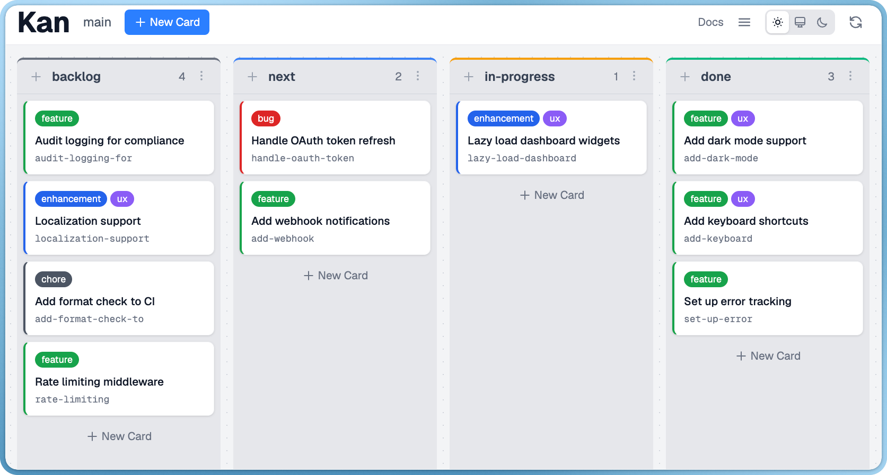

# Kan

A kanban board that lives in your repository.



## What is Kan?

Kan is a kanban board stored as plain files in your repo.
Run `kan serve` to open the web UI, or use the CLI for quick updates.
Since it's just files, your board is version-controlled alongside your code and visible to anyone with access to the repo.

## Quick Start

```bash
kan init
kan serve
```

That's it. Your board opens in the browser.

## Documentation

Full documentation is available at [amterp.github.io/kan](https://amterp.github.io/kan/), or run `kan serve` and visit `/docs`.

## CLI

Most users just need `kan init` and `kan serve`. The web UI handles everything else.

For scripting or automation (CI, AI agents, etc.), Kan has a full CLI:

```bash
kan add "Fix login bug"        # Add a card
kan edit fix-login-bug -c done # Move to column
kan list                       # List all cards
kan show fix-login-bug         # View card details
```

## Why Kan?

Kan works great for solo developers and small teams juggling multiple projects. Every project gets its own board that lives in the repo - open the project, run `kan serve`, and you're right where you left off.

- **Local and fast.** No network calls, no loading spinners. Just files on disk.
- **Self-contained.** No accounts, no syncing, no external services to manage.
- **Version-controlled.** Your board history is your Git history.

## Installation

### Homebrew (macOS)

```bash
brew tap amterp/tap
brew install kan
```

### Go Install

```bash
go install github.com/amterp/kan/cmd/kan@latest
```

## How It Works

Kan stores data in a `.kan/` directory:

```
.kan/
  boards/
    main/
      config.toml        # Board settings, columns, labels
      cards/
        k7xQ2m.json      # One file per card
```

Cards are JSON. Board config is TOML. Version control tracks changes like any other file.

## Status

Kan is usable and actively developed. Core features are solid - boards, cards, columns, custom fields, comments, drag-and-drop, and a full CLI.
Still to come: card relationships and other refinements.
